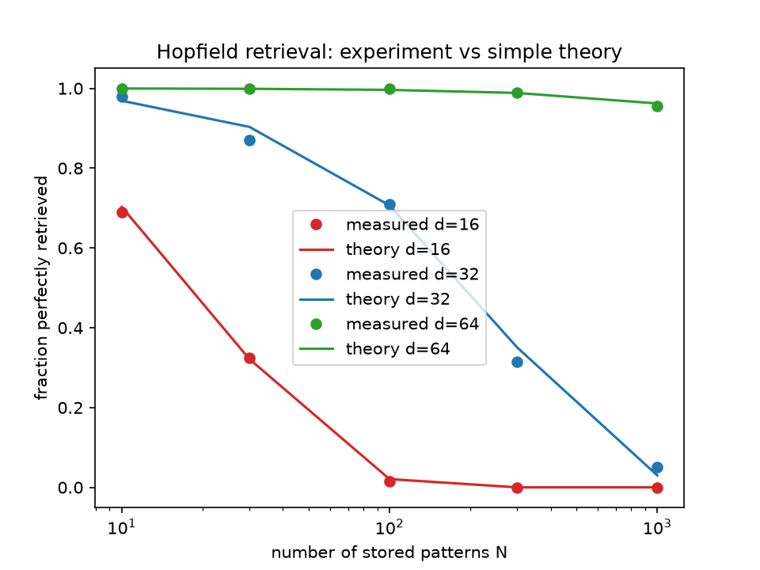

# Hopfield retrieval and attention

Small experiments on the link between Modern Hopfield Networks and Transformer attention.

## Key idea
One retrieval step, softmax(beta * X @ xi) @ X, has the same form as one self-attention step. Here beta is the inverse temperature from statistical mechanics.

## Capacity experiment
I stored random +1/-1 patterns, corrupted 25% of one stored pattern, and checked for exact recovery after one step (200 trials per point, beta = 5).

- Longer patterns store far more memories: at N = 1000, d = 64 recovers almost every time, d = 32 rarely, d = 16 never.
- Measured success follows a simple theory curve: the chance that no other stored pattern scores at least as well as the target.
- Low beta blurs everything into an average, and high beta behaves like picking the best match.

## Files
- attention_basic.py: similarity scores, softmax, weighted average
- attention_beta.py: effect of beta on the attention weights
- hopfield_retrieval.py: first retrieval demo
- capacity_experiment.py, capacity_experiment2.py: sweeps over N, beta, d
- capacity_plot.py: experiment vs theory plot