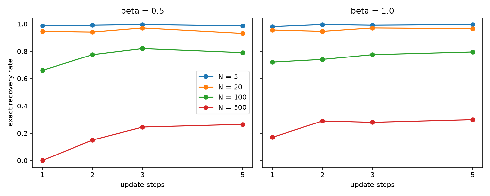

# Hopfield retrieval and attention

Small experiments on the link between Modern Hopfield Networks and Transformer attention.

## Key idea
One retrieval step, softmax(beta * X @ xi) @ X, has the same form as one self-attention step. Here beta is the inverse temperature from statistical mechanics.

## Verification
I implemented self-attention and a Hopfield retrieval step independently, then compared both against PyTorch's own `scaled_dot_product_attention`. All three agree to within floating-point rounding (~1e-8), confirming the equivalence directly rather than assuming it.

## Capacity experiment
I stored random +1/-1 patterns, corrupted 25% of one stored pattern, and checked for exact recovery after one step (200 trials per point, beta = 5).

- Longer patterns store far more memories: at N = 1000, d = 64 recovers almost every time, d = 32 rarely, d = 16 never.
- Measured success follows a simple theory curve: the chance that no other stored pattern scores at least as well as the target.
- Low beta blurs everything into an average, and high beta behaves like picking the best match.

## Files
- attention_basic.py, attention_beta.py: self-attention from scratch, effect of beta
- hopfield_retrieval.py: first Hopfield retrieval demo
- capacity_experiment.py, capacity_experiment2.py, capacity_plot.py: capacity vs N, beta, d, with theory comparison
- attention_vs_hopfield.py: attention and Hopfield step shown numerically identical
- vs_pytorch_attention.py: verified against PyTorch's real attention implementation

## Iterative retrieval
Same setup as above (d = 32, 8 of 32 bits flipped, 200 trials per point), but repeating the update several times and feeding each output back in as the next query.

- Extra steps help the hard cases: at N = 500, beta = 0.5, success goes from 0.0 (1 step) to about 0.27 (5 steps).
- Most of the gain comes from the second step, and results flatten after about 3 steps.
- Low beta needs more steps, because each update sharpens the weights only a little. beta = 0.01 stays at 0 because the weights are almost uniform.
- It plateaus because iteration cannot fix cases where another stored pattern is a closer match to the corrupted query. It then converges to that wrong pattern.